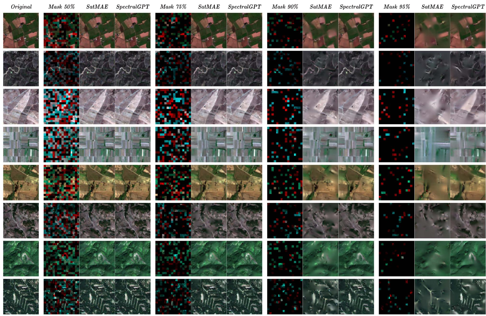

# Awesome_MAE_RS

Collect the latest developments of MAE and its applications in the field of remote sensing

  
SatMAE VS SpectralGPT

# Paper With Code🔥

  ## Sentinel-2 based
  + (NeurIPS'2022)[SatMAE: Pre-training Transformers for Temporal and Multi-Spectral Satellite Imagery](https://arxiv.org/abs/2207.08051)[:octocat:](https://github.com/sustainlab-group/SatMAE) Yezhen Cong, Samar Khanna
  
  ## RGB/Multi-Spectral based
  + (ICCV'2023)[Scale-MAE: A Scale-Aware Masked Autoencoder for Multiscale Geospatial Representation Learning](https://arxiv.org/abs/2212.14532)[:octocat:](https://github.com/bair-climate-initiative/scale-mae?tab=readme-ov-file) Colorado J. Reed, Ritwik Gupta
  + (NeurIPS'2023)[Cross-Scale MAE: A Tale of Multiscale Exploitation in Remote Sensing](https://openreview.net/forum?id=5oEVdOd6TV)[:octocat:](https://github.com/aicip/Cross-Scale-MAE) Maofeng Tang, Andrei Liviu Cozma
  + (CVPR'2024)[SatMAE++: Rethinking Transformers Pre-training for Multi-Spectral Satellite Imagery](https://arxiv.org/abs/2403.05419)[:octocat:](https://github.com/techmn/satmae_pp) Mubashir Noman, Muzammal Naseer
  
  ## Hyper-Spectral based
  + (TGRS'2023)[SS-MAE: Spatial-Spectral Masked Auto-Encoder for Mulit-Source Remote Sensing Image Classification](https://ieeexplore.ieee.org/document/10314566)[:octocat:](https://github.com/summitgao/SS-MAE) Junyan Lin, Feng Gao
  + (TGRS'2024)[S2HM2: A Spectral–Spatial Hierarchical Masked Modeling Framework for Self-Supervised Feature Learning and Classification of Large-Scale Hyperspectral Images](https://ieeexplore.ieee.org/document/10508226)[:octocat:](https://github.com/tulilin/S2HM2) Lilin Tu, Jiayi Li
  + (JSTARS'2024)[HSIMAE: A Unified Masked Autoencoder With Large-Scale Pretraining for Hyperspectral Image Classification](https://ieeexplore.ieee.org/document/10607879)[:octocat:](https://github.com/Ryan21wy/HSIMAE) Yue Wang, Ming Wen
  + (TPAMI'2024)[SpectralGPT: Spectral Remote Sensing Foundation Model](https://ieeexplore.ieee.org/document/10490262)[:octocat:](https://github.com/danfenghong/IEEE_TPAMI_SpectralGPT) Danfeng Hong, Bing Zhang

 ## Multi-Modal based
  + (ECCV'2024)[MMEarth: Exploring Multi-Modal Pretext Tasks For Geospatial Representation Learning](https://arxiv.org/abs/2405.02771)[:octocat:](https://github.com/vishalned/MMEarth-train) Vishal Nedungadi, et al.
